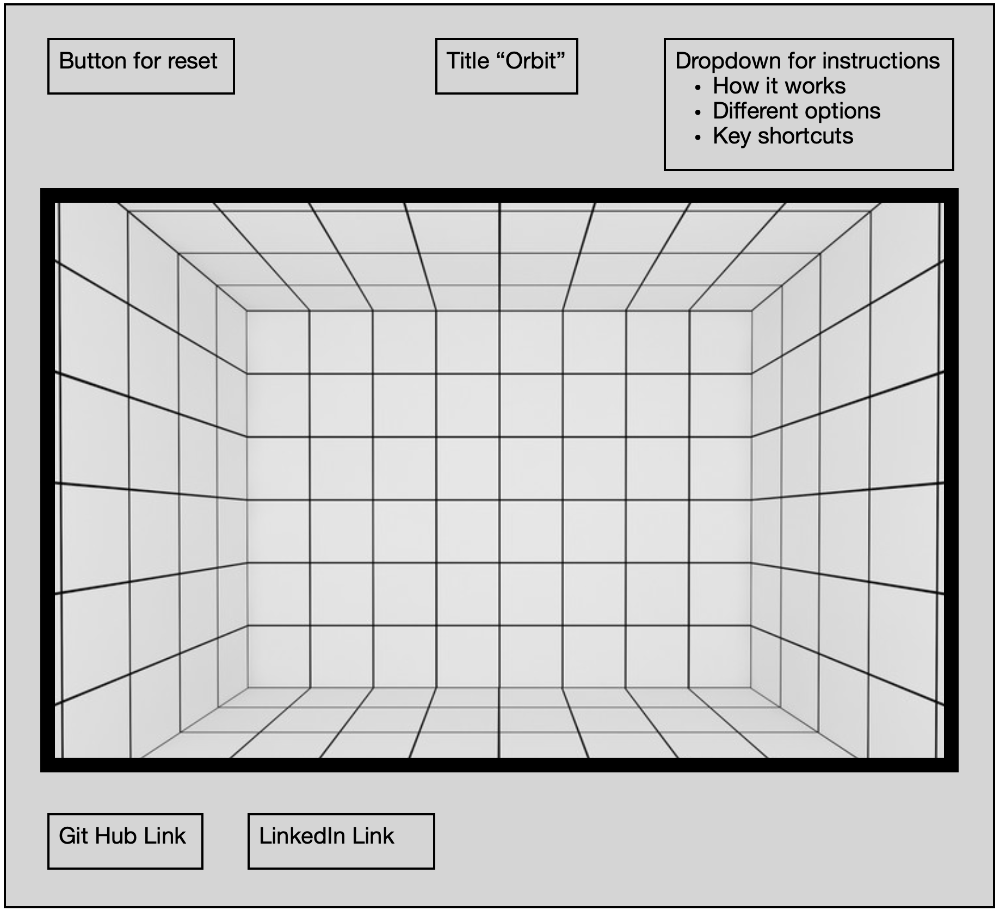

# Orbit

## Background and Overview
Orbit is a live interactive 3D drawing app that will allow you to 
navigate around within a 3D grid and draw on different planes of the grid.

The long term goal of this project will be to eventually draw within a 3D grid
with different options such as rotating the 3D grid while drawing.

## Functionality and MVP

#### Generate a 3D drawing grid
* create/reset a 3D grid on clicking a button
* reset will also repostion camera at center point
#### Draw with cursor
* allow boxes that the cursor is on while left click is down to be removed
* while "d" key is down cursor will remove any cube it touches

#### Adjust current plane in x, y and z direction
* use zoom to navigate in and out of different planes
* use cursor to rotate in x, y, and z and zoom in or out from each direction

## Wire Frame

## File Structure
Orbit
* css
    * reset.css
    * styles.css
* src
    * images
        * angelList.png
        * github.png
        * linkedIn.png
        * second.png
    * sripts
        * build.js
* index.html

## Architecture and Technology

* Will be using HTML canvas element for drawing on grid
* will be using THREE.js for all 3D manipulation
    * using InstancedMesh from THREE.js for more efficient rendering and removal of cubbies through setMatrixAt
    
## Implementation Timeline
*  Day one & two
    *   General setup
    *   Generate 3D grid ()
    *   implement grid reset button
*  Day three
    *   Implement drawing option ()
*  Day four
    *   Adjust which layer is being drawn on
## Bonus Features
* allow user to draw while the grid is rotating at variable speeds and or
directions