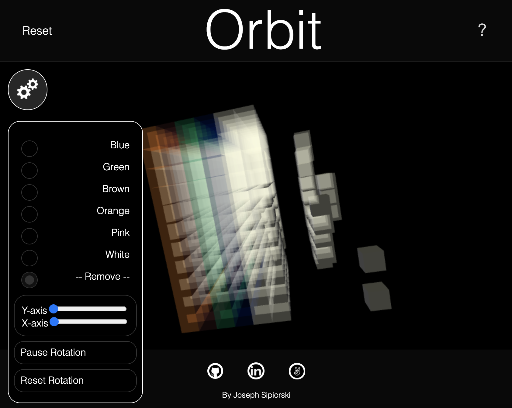

# Orbit

### Live link 
https://josefsipi.github.io/orbit3.1/

## Background and Overview
Orbit is a live interactive 3D drawing app that will allow you to navigate around within a 3D grid and remove certain cubes to create a desired shape.

## How it works

Users will be able to rotate the cube by dragging it in the desired direction with left clicks, additionally by using the scroll users will be able to navigate into or out of the cube.

Users can create shapes out of the cube by removing smaller cubes from the larger cube, this can be done by using left click or by holding the “d” key; left click will remove a single cube whereas holding the “d” key will remove any cube the mouse is currently hovering over and will continue to remove cubes as the cube or mouse moves beneath it. The “s” key can be held down to prevent any cube removal functionality, it will prevent the left click from removing cubes allowing the user to navigate without a fear of unintentionally removing cubes.




The long term goal of this project will be to eventually draw within a 3D grid with different options such as rotating the 3D grid while drawing as well as changing colors of specific cubes and adding additional cubes.

## Technologies/Technical Challenges

Orbit is created using THREE.js in an HTML canvas element. Because of the number of cubes that are rendered during an animation frame InstancedMesh was used to create the 3D object, which optimizes overall rendering performance by reducing the number of draw calls.

## Removing cubes with "d" key and prevent cube removal with "s" key

By dynamically evaluating the key that was/is pressed during a keyDown event the following code is able to either prevent a cube from being removed when “s” key is held down and left click occurs as well as remove any cube that the mouse touches while the “d” key is pressed.

The cubes are removed by relocating cubes by setting new instanceMatrix points for the selected cube, utilizing the efficiency of the instancedMesh to optimize rendering. 

```javascript
keyDown = function(event) {
    event.preventDefault();

    if(event.key === "d"){

        raycaster.setFromCamera( mouse, camera );
        
        const intersection = raycaster.intersectObjects( scene.children, true );

        var newMatrix = new THREE.Matrix4();
        newMatrix.setPosition(-1000, -10000, -1000);

        if ( intersection.length > 0 ) {

            const instanceId = intersection[ 0 ].instanceId;

            newCube.setMatrixAt( instanceId, newMatrix )
            newCube.instanceMatrix.needsUpdate = true;

        }

        renderer.render(scene, camera);

    } else if (event.key === 's') {
        sKeyStatus = true;
    }

```

## Bonus Features
* Allow user to change the color of cubes as well as add cubes back
* Allow users to change from wireframe to solid
* Allow users to download 3D shape that they created